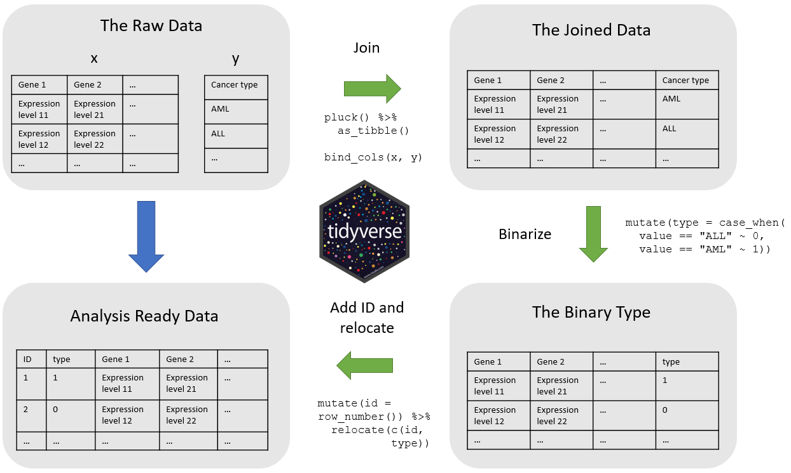
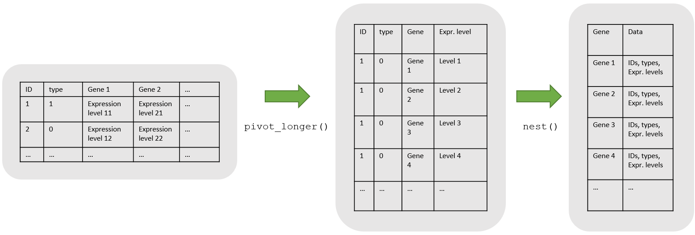
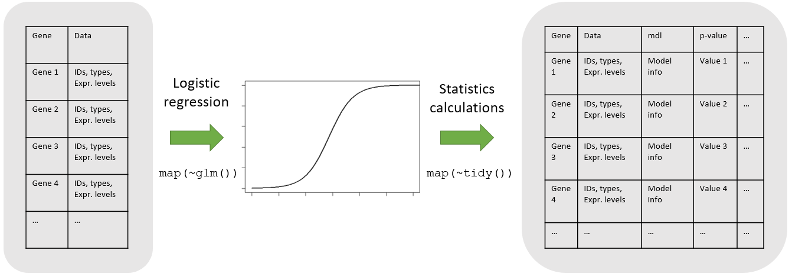

---
title: "Identification of Important Genes in Leukemia Patients"
output: 
  ioslides_presentation:
      widescreen: true
      self_contained: true
author: Emma Ahrensbach Rørbeck (s173733), Julie Maria Johansen (s174595), Simone Majken Stegenborg-Grathwohl (s174596), and Charlotte Würtzen (s174564)
--- 

<style>
.forceBreak { -webkit-column-break-after: always; break-after: column; }
</style>

```{r setup, include = FALSE}
rm(list = ls())
knitr::opts_chunk$set(echo = FALSE)
library("knitr")
```

## Introduction

- 7129 measurements of gene expressions
- 72 Leukemia patients
- ALL: Acute Lymphoblastic Leukemia
- AML: Acute Myeloid Leukemia

# Methods

## Tidying
```{r, echo = FALSE, eval = TRUE, out.width = "90%",  fig.height = 3}

```

## Data Wrangling 
```{r, echo = FALSE, eval = TRUE, out.width = "100%",  fig.height = 3}

```

## Modelling

Logistic regression

```{r, echo = FALSE, eval = TRUE, out.width = "100%",  fig.height = 3}

```

# Results 

## Visualisations
```{r bar count, out.width = "100%", fig.height = 8, echo = FALSE}
include_graphics("../results/07_barcount.png")
```

## Visualisations
```{r heatmap, out.width = "100%", fig.height = 8, echo = FALSE}
include_graphics("../results/06_heatmap.png")
```

## Visualisations
```{r barplot, out.width = "100%", fig.height = 8, echo = FALSE}
include_graphics("../results/07_barplot.png")
```

## Visualisations {.columns-2 .smaller}
```{r boxplot ALL, out.width = "100%", fig.height = 8, echo = FALSE}
include_graphics("../results/07_boxplot_ALL.png")
```
<p class="forceBreak"></p>
```{r boxplot AML, out.width = "100%", fig.height = 8, echo = FALSE}
include_graphics("../results/07_boxplot_AML.png")
```

# Discussion 
## Discussion
- Data transformation
  - Normalization vs. log2-fold


## Discussion
- Data transformation
- Modelling 
<p class="forceBreak"></p>
```{r scree, out.width = "80%", fig.height = 8, echo = FALSE}
include_graphics("../results/05_PCA_plot3.png")
```

## Discussion
- Data transformation
- Modelling 
- Plots 
<p class="forceBreak"></p>
```{r heatmap_dis, out.width = "70%", fig.height = 8, echo = FALSE}
include_graphics("../results/06_heatmap.png")
```

## Discussion

### Most important genes 
- ALL: Y0043_at encodes GPX1
- AML: M11147_at endcodes the light subunit of ferritin protein

<p class="forceBreak"></p>
```{r boxplot, out.width = "50%", fig.height = 8, echo = FALSE}
include_graphics("../results/07_boxplot_ALL.png")
include_graphics("../results/07_boxplot_AML.png")
```

## Conclusion
- Data transformation 
- PCA and K-means not suitable for our data
- Logistic regression and p-values used for deciding important genes
- We were able to convey our message through plots 
- The most important genes for AML and ALL found in our project are also found to be involved in leukemia in literature