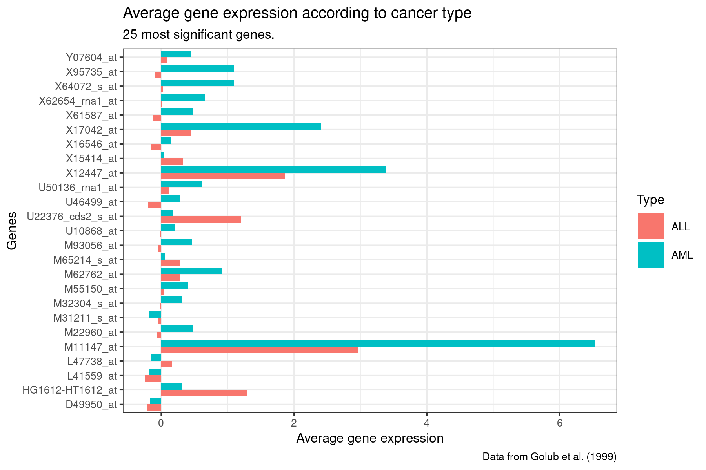
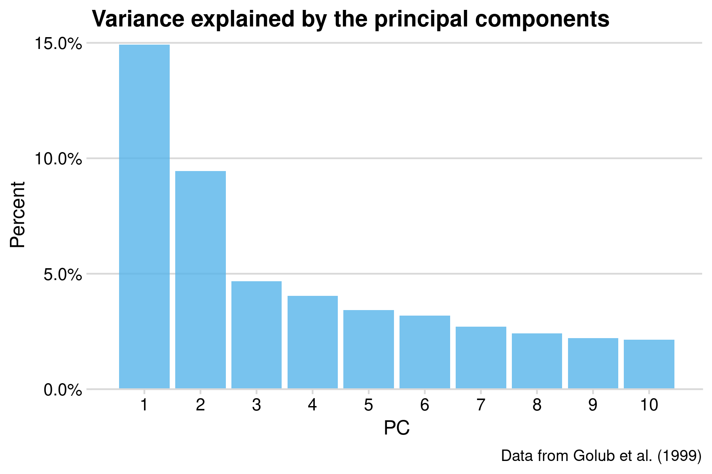
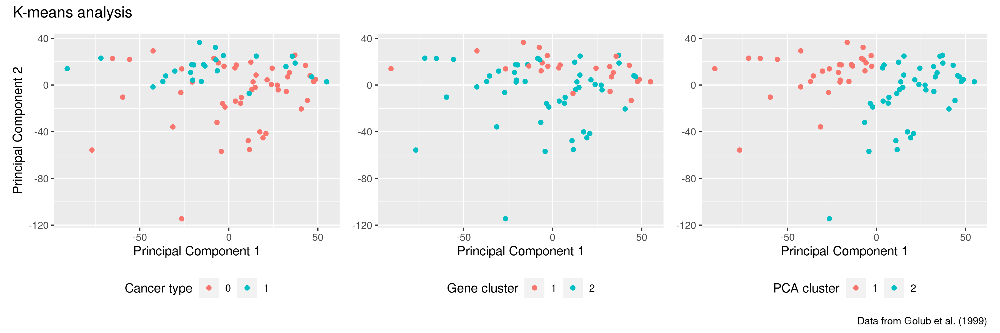

---
title: "Leukemia"
output: 
  ioslides_presentation:
      widescreen: true
author: Emma Ahrensbach Rørbeck (s173733), Julie Maria Johansen (s174595), Simone Majken Stegenborg-Grathwohl (s174596) and Charlotte Würtzen (s174564)
--- 

<style>
.forceBreak { -webkit-column-break-after: always; break-after: column; }
</style>

```{r setup, include=FALSE}
rm(list = ls())
knitr::opts_chunk$set(echo = FALSE)
library("knitr")
```

## Introduction

- 7129 measurements of gene expressions
- 72 Leukemia patients
- ALL: Acute Lymphoblastic Leukemia
- AML: Acute Myeloid Leukemia

# Methods

## Tidying
```{r, echo = FALSE, eval = TRUE, out.width = "90%",  fig.height = 3}


```

## Data Wrangling 
```{r, echo = FALSE, eval = TRUE, out.width = "100%",  fig.height = 3}
include_graphics("LongerNest.PNG")

```

## Modelling

Logistic regression

```{r, eval = FALSE, echo = TRUE}
golub_model <- golub_long_nested %>%
  mutate(mdl = map(data, ~glm(type ~ norm_expr_level,
                              data = .x,
                              family = binomial(link = "logit"))))

golub_model <- golub_model %>%
  mutate(mdl_tidy = map(mdl, ~tidy(.x,
                                   conf.int = TRUE))) %>% 
  unnest(mdl_tidy)
```

## Modelling

PCA

```{r, eval = FALSE, echo = TRUE}
pca_fit <- golub_clean_aug %>% 
  select(where(is.numeric),
         -c(type, id)) %>% 
  prcomp(scale = TRUE)
```

## Modelling

PCA

```{r, eval = FALSE, echo = TRUE}
pca_fit <- golub_clean_aug %>% 
  select(where(is.numeric),
         -c(type, id)) %>% 
  prcomp(scale = TRUE)
```

K means analysis

```{r, eval = FALSE, echo = TRUE}
k_type <- golub_clean_aug %>%
  select(-c(type, 
            value, 
            id)) %>%
  kmeans(centers = 2)
```

# Results 

## Visualisations
```{r bar count, out.width = "100%", fig.height = 8, echo = FALSE}
include_graphics("../results/07_barcount.png")
```

%## Visualisations {.smaller}
```{r, echo = FALSE, eval = FALSE}
heatmap <- golub_top_genes %>% 
  mutate(type = case_when(type == 0 ~ "ALL",
                          type == 1 ~ "AML")) %>% 
  ggplot(mapping = aes(x = id, 
                       y = gene, 
                       fill = norm_expr_level)) +
  geom_tile() +
  theme_classic(base_size = 12) +
  ggtitle("Normalized gene expression levels distinguishing ALL and AML") + 
  scale_fill_gradient2(low = "blue", 
                       high = "red", 
                       mid = "white",
                       midpoint = 2) +
  xlab(label = "Patient ID") + 
  ylab(label = "Genes") + 
  labs(fill = "Normalized expression level",
       caption = "Data from Golub et al. (1999)") +
  theme(legend.position="bottom",
        plot.title = element_text(size = rel(1.7)),
        axis.title.y = element_text(size = rel(1.4)),
        axis.title.x = element_text(size = rel(1.4))) +
  facet_grid(~type, 
             switch = "x", 
             scales = "free_x", 
             space = "free_x")
```

## Visualisations
```{r heatmap, out.width = "100%", fig.height = 8, echo = FALSE}
include_graphics("../results/06_heatmap.png")
```

## Visualisations
```{r barplot, out.width = "100%", fig.height = 8, echo = FALSE}

```

## Visualisations {.columns-2 .smaller}
```{r boxplot ALL, out.width = "100%", fig.height = 8, echo = FALSE}
include_graphics("../results/07_boxplot_ALL.png")
```
<p class="forceBreak"></p>
```{r boxplot AML, out.width = "100%", fig.height = 8, echo = FALSE}
include_graphics("../results/07_boxplot_AML.png")
```

## PCA {.columns-2 .smaller}
```{r, out.width = "100%", echo = FALSE}

```
<p class="forceBreak"></p>
```{r, out.width = "100%", echo = FALSE}

```


## K-means analysis
```{r, out.width = "95%", echo = FALSE}

```


# Discussion 
## Discussion
- Data transformation
  - Normalization vs. log2-fold


## Discussion
- Data transformation
- Modelling 
<p class="forceBreak"></p>
```{r scree, out.width = "80%", fig.height = 8, echo = FALSE}

```

## Discussion
- Data transformation
- Modelling 
<p class="forceBreak"></p>
```{r kmeans, out.width = "70%", fig.height = 8, echo = FALSE}

```

## Discussion
- Data transformation
- Modelling 
- Plots 
<p class="forceBreak"></p>
```{r heatmap_dis, out.width = "70%", fig.height = 8, echo = FALSE}
include_graphics("../results/06_heatmap.png")
```

## Discussion

### Most important genes 
- ALL: Y0043_at encodes GPX1
- AML: M11147_at endcodes the light subunit of ferritin protein

<p class="forceBreak"></p>
```{r boxplot, out.width = "50%", fig.height = 8, echo = FALSE}
include_graphics("../results/07_boxplot_ALL.png")
include_graphics("../results/07_boxplot_AML.png")
```

## Conclusion
- Data transformation 
- PCA and K-means not suitable for our data
- Logistic regression and p-values used for deciding important genes
- We were able to convey our message through plots 
- The most important genes for AML and ALL found in our project are also found to be involved in leukemia in literature