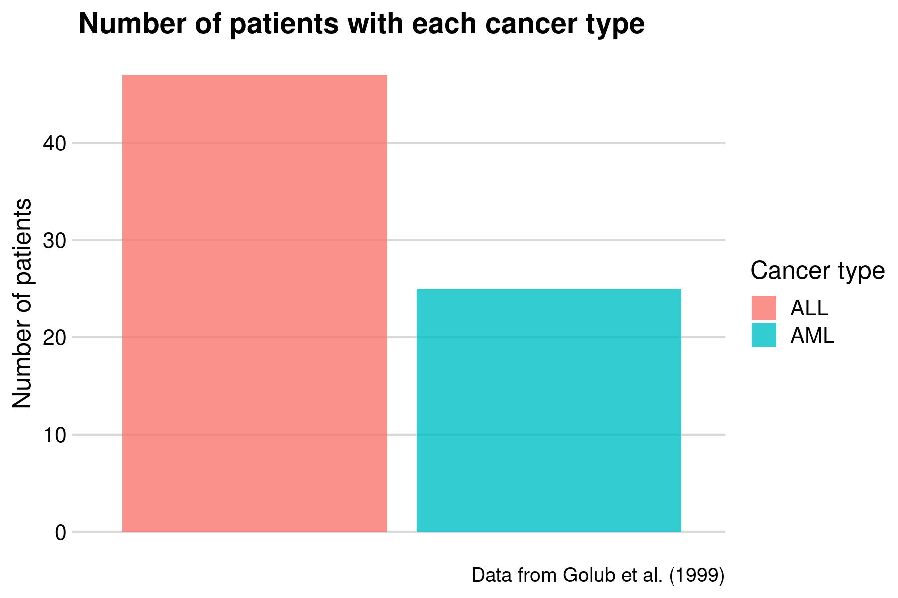

---
title: "Leukemia"
output: 
  ioslides_presentation:
      widescreen: true
author: Emma Ahrensbach Rørbeck (s173733), Julie Maria Johansen (s174595), Simone Majken Stegenborg-Grathwohl (s174596) and Charlotte Würtzen (s174564)
--- 

<style>
.forceBreak { -webkit-column-break-after: always; break-after: column; }
</style>


```{r setup, include=FALSE}
rm(list = ls())
knitr::opts_chunk$set(echo = FALSE)
library("tidyverse")
library("cowplot")
library("broom")
library("knitr")
load(file = "../data/_raw/golub.RData")
source(file = "../R/99_project_functions.R")
```


# Results 

## Visualisations
```{r bar count, out.width = "100%", fig.height = 8, echo = FALSE}

```

## Visualisations {.smaller}

### Heatmap: Building the code
```{r, echo = TRUE, eval = FALSE}
heatmap <- golub_top_genes %>% 
  mutate(type = case_when(type == 0 ~ "ALL",
            type == 1 ~ "AML")) %>% 
  ggplot(mapping = aes(x = id, 
                       y = gene, 
                       fill = norm_expr_level)) +
  geom_tile() +
  theme_classic(base_size = 12) +
  ggtitle("Normalized gene expression levels distinguishing ALL and AML") + 
  scale_fill_gradient2(low = "blue", 
                       high = "red", 
                       mid = "white",
                       midpoint = 2) +
  xlab(label = "Patient ID") + 
  ylab(label = "Genes") + 
  labs(fill = "Normalized expression level",
       caption = "Data from Golub et al. (1999)") +
  theme(legend.position="bottom",
        plot.title = element_text(size = rel(1.7)),
        axis.title.y = element_text(size = rel(1.4)),
        axis.title.x = element_text(size = rel(1.4))) +
  facet_grid(~type, 
             switch = "x", 
             scales = "free_x", 
             space = "free_x")
```

## Visualisations
```{r heatmap, out.width = "100%", fig.height = 8, echo = FALSE}
include_graphics("../results/06_heatmap.png")
```

## Visualisations
```{r barplot, out.width = "100%", fig.height = 8, echo = FALSE}
include_graphics("../results/07_barplot.png")
```

## Visualisations {.columns-2 .smaller}
```{r boxplot ALL, out.width = "100%", fig.height = 8, echo = FALSE}
include_graphics("../results/07_boxplot_ALL.png")
```
<p class="forceBreak"></p>
```{r boxplot AML, out.width = "100%", fig.height = 8, echo = FALSE}
include_graphics("../results/07_boxplot_AML.png")
```


***


