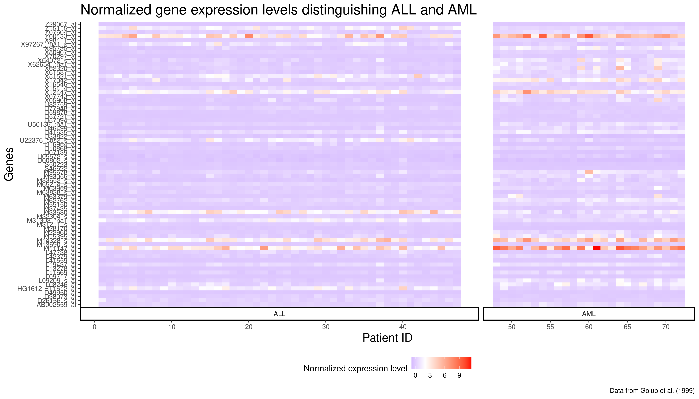
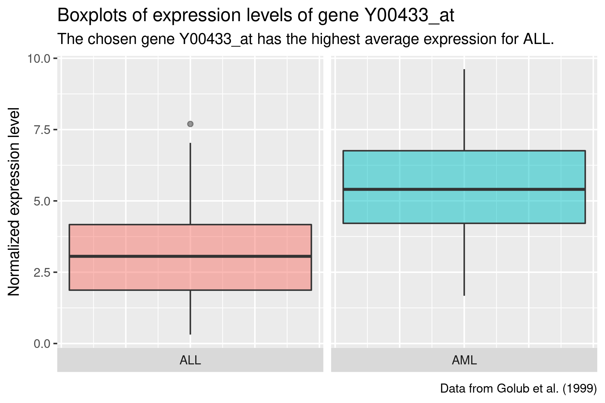

---
title: "Leukemia"
output: 
  ioslides_presentation:
      widescreen: true
author: Emma Ahrensbach Rørbeck (s173733), Julie Maria Johansen (s174595), Simone Majken Stegenborg-Grathwohl (s174596) and Charlotte Würtzen (s174564)
--- 

<style>
.forceBreak { -webkit-column-break-after: always; break-after: column; }
</style>

```{r setup, include=FALSE}
rm(list = ls())
knitr::opts_chunk$set(echo = FALSE)
library("tidyverse")
library("cowplot")
library("broom")
library("knitr")
load(file = "../data/_raw/golub.RData")
source(file = "../R/99_project_functions.R")
```


## Introduction


# Methods

## Data wrangling {.smaller}

```{r wrangle, echo = TRUE}
x_data <- golub %>% 
  pluck("x") %>% 
  as_tibble()

y_data <- golub %>% 
  pluck("y") %>% 
  as_tibble()

golub_clean <- bind_cols(x_data,y_data)

golub_clean_aug <- golub_clean %>% 
  mutate(type = case_when(value == "ALL" ~ 0,
                          value == "AML" ~ 1)) %>% 
  mutate(id = row_number()) %>% 
  relocate(c(id, type))

```

```{r, cars, echo=FALSE}
head(golub_clean_aug, n=5L)
```


## More data wrangling 
```{r pivot, echo = FALSE}
# Pivot longer 
golub_long <- longer(golub_clean_aug)

# Grouping and nesting 
golub_long_nested <- groupnest(golub_long, gene)
```

## Modelling

## Logistic regression

```{r logit, echo = TRUE, warning = FALSE, eval = FALSE}
golub_model <- golub_long_nested %>%
  mutate(mdl = map(data, ~glm(type ~ norm_expr_level,
                              data = .x,
                              family = binomial(link = "logit"))))

```

```{r, echo=FALSE, eval = FALSE}
head(golub_model, n=10L)
```

```{r, include = FALSE, eval = FALSE}
# Add model information
golub_model <- golub_model %>%
  mutate(mdl_tidy = map(mdl, ~tidy(.x, conf.int = TRUE))) %>% 
  unnest(mdl_tidy)

# Look at slope only (remove intercept rows)
golub_model <- golub_model %>% 
  filter(str_detect(term, "level")) %>% 
  select(-term)

# Significance of p < alpha
alpha <- 0.01

golub_model <- golub_model %>% 
  mutate(identified_as = case_when(p.value < alpha ~ "Significant",
                                   p.value >= alpha ~ "Non-significant"))

# Extract significant genes
significant_genes <- golub_model %>% 
  filter(identified_as == "Significant")

# Top genes
top_genes <- significant_genes %>% 
  arrange(p.value) %>% 
  head(n = 71L) %>% 
  unnest(data) %>% 
  select(c(id, gene, type, norm_expr_level))

```

```{r, include = FALSE}
top_genes <- read_tsv(file = "../data/04_top_genes.tsv.gz")

```


## PCA {.columns-2 .smaller}


```{r, include = FALSE}
top_gene_names = top_genes %>% 
  groupnest(gene) %>% 
  head(n = 10L) %>% 
  select(-data)
```

```{r pca, echo = TRUE}
pca_fit <- golub_clean_aug %>% 
  select(where(is.numeric),
         -c(type, id)) %>% 
  prcomp(scale = TRUE)
```

```{r, include = FALSE}
pca_aug <- pca_fit %>% 
  augment(golub_clean_aug)
```
<p class="forceBreak"></p>

```{r PCA_plot, echo = FALSE, out.width = "100%",  fig.height = 3}
include_graphics("../results/05_PCA_plot2.png")
```


## K-means 
```{r, echo = TRUE}
# Kmeans clustering based on gene expressions
k_type <- golub_clean_aug %>%
  select(-c(type, value, id)) %>%
  kmeans(centers = 2)
```

```{r, include = FALSE}

pca_aug_k_type <- k_type %>%
  augment(pca_aug) %>% 
  rename(cluster_type = .cluster)

```

```{r}
# Kmeans clustering based on principal components 
k_pca <- pca_aug_k_type %>%
  select(.fittedPC1, .fittedPC2) %>%
  kmeans(centers = 2)

```
```{r, include = FALSE}
pca_aug_k_type_pca <- k_pca %>%
  augment(pca_aug_k_type) %>% 
  rename(cluster_pca = .cluster)
```

<center>
```{r kmeans_plot, echo = FALSE, out.width = "75%", fig.height= 4}
include_graphics("../results/05_kmeans_plot.png")
```
></center>

{.columns-2 .smaller}
<p class="forceBreak"></p>

# Results 

## Bar plot of cancer type count 
```{r bar count, out.width = "100%", fig.height = 8, echo = FALSE}
include_graphics("../results/07_barcount.png")
```

## Visualising gene expression levels with heatmap

### Building the code
```{r, echo = TRUE, message = FALSE, eval = FALSE}
heatmap <- golub_top_genes %>% 
  mutate(type = case_when(type == 0 ~ "ALL",
            type == 1 ~ "AML")) %>% 
  ggplot(mapping = aes(x = id, 
                       y = gene, 
                       fill = norm_expr_level)) +
  geom_tile() +
  theme_classic(base_size = 12) +
  ggtitle("Normalized gene expression levels distinguishing ALL and AML") + 
  scale_fill_gradient2(low = "blue", 
                       high = "red", 
                       mid = "white",
                       midpoint = 2) +
  xlab(label = "Patient ID") + 
  ylab(label = "Genes") + 
  labs(fill = "Normalized expression level",
       caption = "Data from Golub et al. (1999)") +
  theme(legend.position="bottom",
        plot.title = element_text(size = rel(1.7)),
        axis.title.y = element_text(size = rel(1.4)),
        axis.title.x = element_text(size = rel(1.4))) +
  facet_grid(~type, 
             switch = "x", 
             scales = "free_x", 
             space = "free_x")
```


##
```{r heatmap, out.width = "100%", fig.height = 8, echo = FALSE}

```

## Bar plot
```{r barplot, out.width = "100%", fig.height = 8, echo = FALSE}
include_graphics("../results/07_barplot.png")
```

## Boxplots {.columns-2 .smaller}

- bla bla
- kfena

```{r boxplot ALL, out.width = "100%", fig.height = 8, echo = FALSE}

```
<p class="forceBreak"></p>
```{r boxplot AML, out.width = "100%", fig.height = 8, echo = FALSE}
include_graphics("../results/07_boxplot_AML.png")
```


# Discussion

- important to distinguish which genes are important/significant
- missing reference/control group to compare with healthy individuals
- data set possibly more suitable for neural network analysis => prediction of cancer type
- PCA and K-means not relevant for this data? 
dimensionality reduction not ideal when variance explained is so low for each PC
Not clear cluster differentiation

## Conclusion

- sum up


